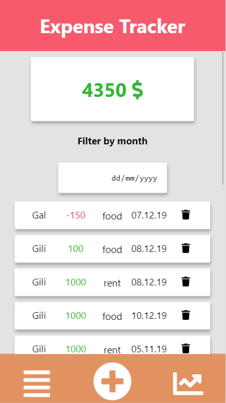
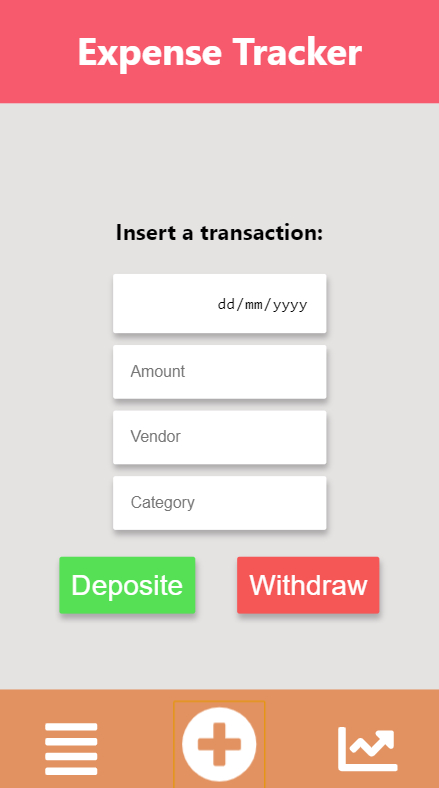
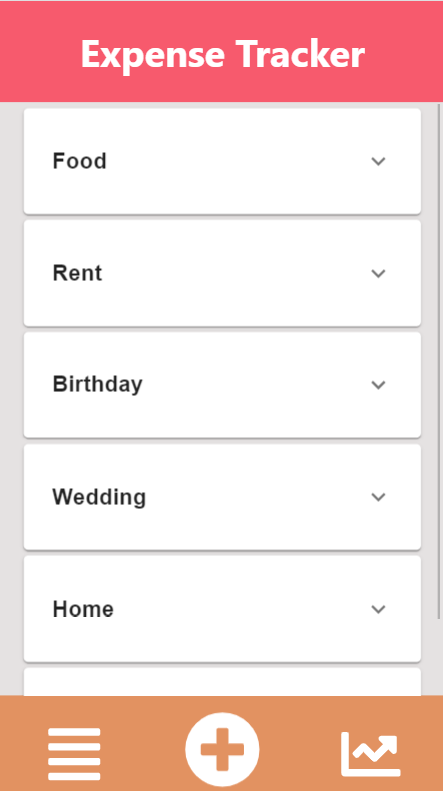
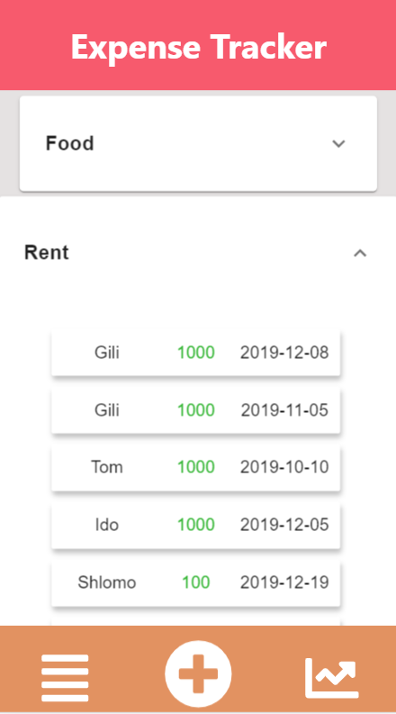

# Bank

Bank is an expense tracking application for user to track his monthly expenses.

## Table Of Contents
- [Bank](#bank)
  * [Running the project](#running-the-project)
  * [Screenshots](#screenshots)
    + [Expense-List](#expense-list)
    + [Add Expense](#add-expense)
    + [Reports](#reports)
    + [Category Breakdown](#category-breakdown)
  * [Tech Stack](#tech-stack)
  * [TODO](#todo)

## Running the project
1. Clone the repo.
2. Run `npm install`.
3. Run `npm run build`
4. Run `mongod`
5. Run `npm start`.
6. Navigate to `http://localhost:4200`.

## Screenshots

### Expense List
An overview of all your expenses sorted by date. Choosing a month will show the expenses of the chosen month.

### Add Expense
Fill out the inputs and then click *Deposite* or *Withdraw* to add a new expense.

### Category Breakdown
View a report of the totals by category.

Expanded each category to show expenses of the relevant category

## Techstack
1. React, Material-UI and Axios.
2. Express (Node.js), Mongoose (MongoDB).

## TODO
1. Add a tab view in the reports screen and add an expense report by user.
2. Compare totals between months and show if specific categories increased or decreased between months.
